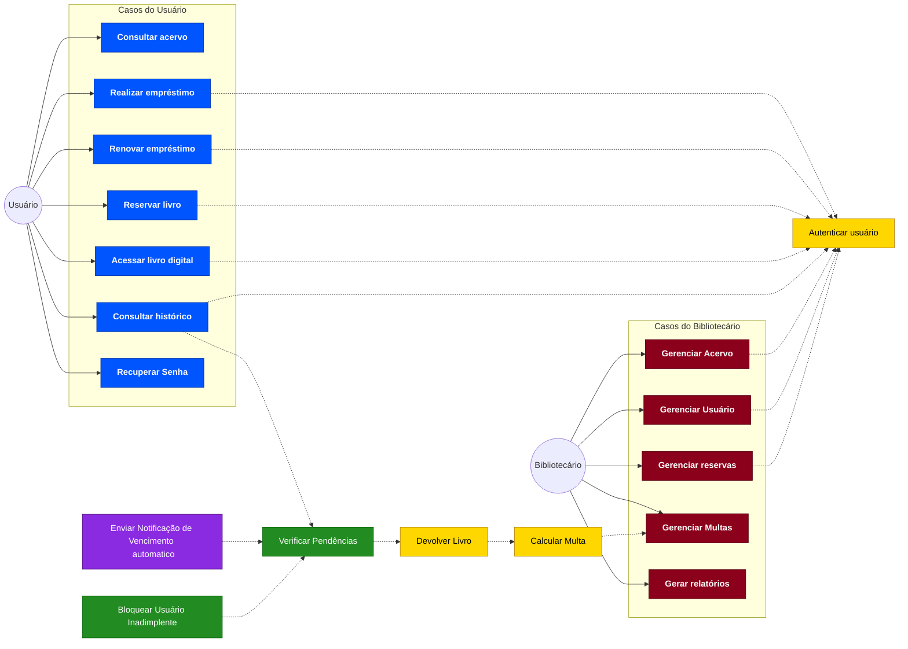
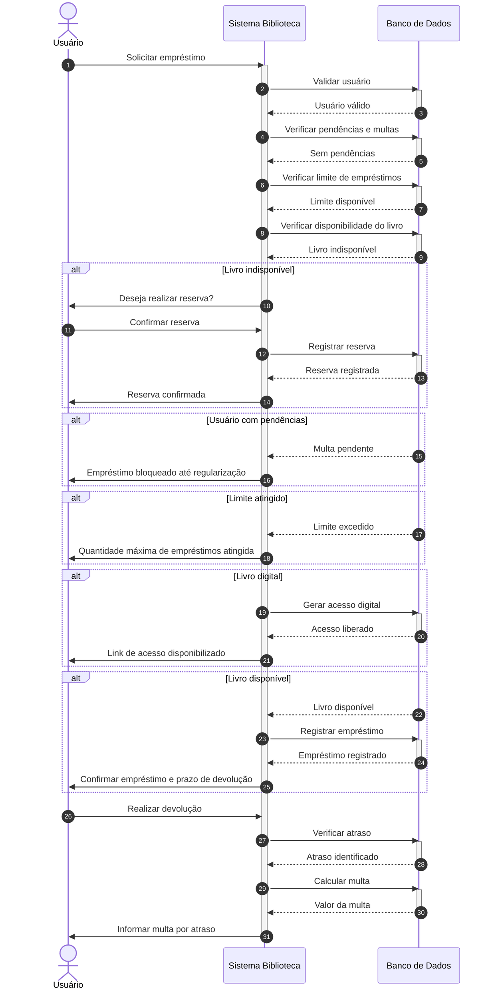

# Diagrams

---

## Sobre

Este documentos apresenta os diagramas de caso de uso e sequência da aplicação

---

## Diagrama de caso de uso

```mermaid
graph LR
    %% Definição de Atores (Estilizados como círculos ou nós específicos)
    User((Usuário))
    Librarian((Bibliotecário))

    %% Casos de Uso do Usuário (Azuis)
    subgraph Casos do Usuário
        U1[Consultar acervo]
        U2[Realizar empréstimo]
        U3[Renovar empréstimo]
        U4[Reservar livro]
        U5[Acessar livro digital]
        U6[Consultar histórico]
        U7[Recuperar Senha]
    end

    %% Casos de Uso do Bibliotecário (Vermelhos)
    subgraph Casos do Bibliotecário
        B1[Gerenciar Acervo]
        B2[Gerenciar Usuário]
        B3[Gerenciar reservas]
        B4[Gerenciar Multas]
        B5[Gerar relatórios]
    end

    %% Elementos de Autenticação, Regras e Automações (Centro)
    Auth[Autenticar usuário]
    Return[Devolver Livro]
    Calc[Calcular Multa]
    Check[Verificar Pendências]
    Block[Bloquear Usuário Inadimplente]
    Notify[Enviar Notificação de Vencimento <br> automatico]

    %% Conexões do Usuário
    User --> U1
    User --> U2
    User --> U3
    User --> U4
    User --> U5
    User --> U6
    User --> U7

    %% Conexões do Bibliotecário
    Librarian --> B1
    Librarian --> B2
    Librarian --> B3
    Librarian --> B4
    Librarian --> B5

    %% Relacionamentos e Dependências Internas (Tracejadas)
    U2 -.-> Auth
    U3 -.-> Auth
    U4 -.-> Auth
    U5 -.-> Auth
    U6 -.-> Auth

    B1 -.-> Auth
    B2 -.-> Auth
    B3 -.-> Auth

    U6 -.-> Check
    Notify -.-> Check
    Check -.-> Return
    Return -.-> Calc
    Calc -.-> B4
    Block -.-> Check

    %% Estilização para bater com as cores da imagem
    classDef userCase fill:#0055ff,stroke:#0033aa,color:#fff,font-weight:bold;
    classDef libCase fill:#8b001a,stroke:#550010,color:#fff,font-weight:bold;
    classDef systemYellow fill:#ffd700,stroke:#b8860b,color:#000;
    classDef systemGreen fill:#228b22,stroke:#006400,color:#fff;
    classDef systemPurple fill:#8a2be2,stroke:#4b0082,color:#fff;

    class U1,U2,U3,U4,U5,U6,U7 userCase;
    class B1,B2,B3,B4,B5 libCase;
    class Auth,Return,Calc systemYellow;
    class Check,Block systemGreen;
    class Notify systemPurple;
```

---

## Diagrama de sequência

```mermaid
sequenceDiagram
    autonumber
    actor Usuario as Usuário
    participant Sistema as Sistema Biblioteca
    participant BD as Banco de Dados

    %% Fluxo Inicial de Verificações
    Usuario->>Sistema: Solicitar empréstimo
    activate Sistema
    Sistema->>BD: Validar usuário
    activate BD
    BD-->>Sistema: Usuário válido
    deactivate BD
    
    Sistema->>BD: Verificar pendências e multas
    activate BD
    BD-->>Sistema: Sem pendências
    deactivate BD

    Sistema->>BD: Verificar limite de empréstimos
    activate BD
    BD-->>Sistema: Limite disponível
    deactivate BD

    Sistema->>BD: Verificar disponibilidade do livro
    activate BD
    BD-->>Sistema: Livro indisponível
    deactivate BD

    %% Bloco Alt: Livro Indisponível
    alt Livro indisponível
        Sistema->>Usuario: Deseja realizar reserva?
        Usuario->>Sistema: Confirmar reserva
        Sistema->>BD: Registrar reserva
        activate BD
        BD-->>Sistema: Reserva registrada
        deactivate BD
        Sistema->>Usuario: Reserva confirmada
    end

    %% Bloco Alt: Usuário com pendências
    alt Usuário com pendências
        BD-->>Sistema: Multa pendente
        Sistema->>Usuario: Empréstimo bloqueado até regularização
    end

    %% Bloco Alt: Limite atingido
    alt Limite atingido
        BD-->>Sistema: Limite excedido
        Sistema->>Usuario: Quantidade máxima de empréstimos atingida
    end

    %% Bloco Alt: Livro digital
    alt Livro digital
        Sistema->>BD: Gerar acesso digital
        activate BD
        BD-->>Sistema: Acesso liberado
        deactivate BD
        Sistema->>Usuario: Link de acesso disponibilizado
    end

    %% Bloco Alt: Livro disponível
    alt Livro disponível
        BD-->>Sistema: Livro disponível
        Sistema->>BD: Registrar empréstimo
        activate BD
        BD-->>Sistema: Empréstimo registrado
        deactivate BD
        Sistema->>Usuario: Confirmar empréstimo e prazo de devolução
    end

    %% Fluxo de Devolução no final do diagrama
    Usuario->>Sistema: Realizar devolução
    Sistema->>BD: Verificar atraso
    activate BD
    BD-->>Sistema: Atraso identificado
    deactivate BD
    
    Sistema->>BD: Calcular multa
    activate BD
    BD-->>Sistema: Valor da multa
    deactivate BD
    Sistema->>Usuario: Informar multa por atraso
    deactivate Sistema
```

---
