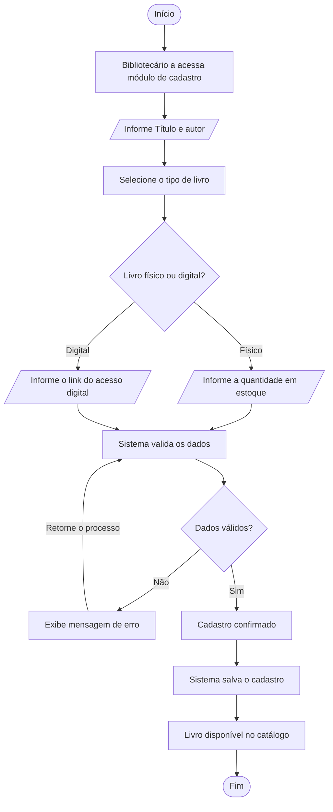
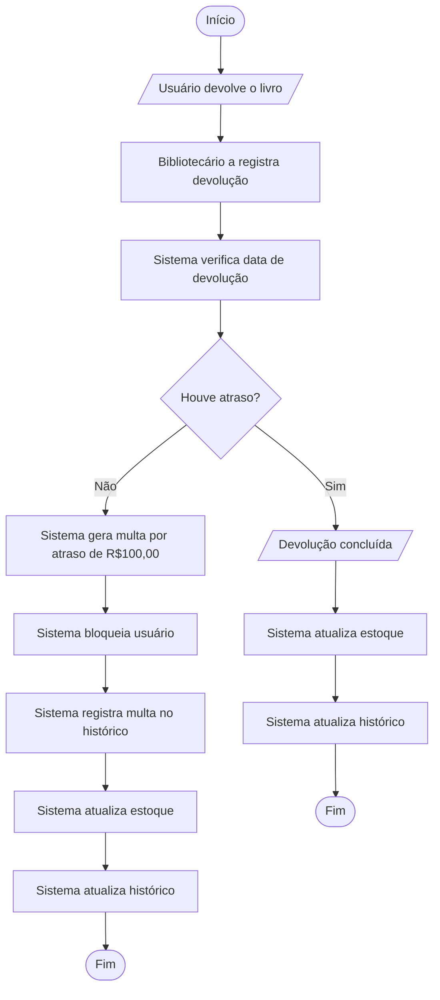
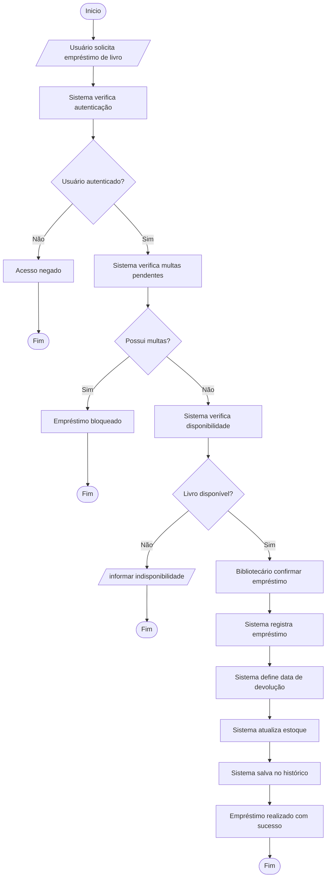

# Flows

---

## Sobre

Esse documento detalha os fluxos de uso da aplicação

---

## Fluxo de cadastro de livros

```mermaid
graph TD
    A([Início]) --> B[Bibliotecário a acessa módulo de cadastro]
    B --> C[/Informe Título e autor/]
    C --> D[Selecione o tipo de livro]
    D --> E{Livro físico ou digital?}
    
    E -->|Físico| F[/Informe a quantidade em estoque/]
    E -->|Digital| G[/Informe o link do acesso digital/]
    
    F --> H[Sistema valida os dados]
    G --> H
    
    H --> I{Dados válidos?}
    
    I -->|Não| J[Exibe mensagem de erro]
    J -->|Retorne o processo| H
    
    I -->|Sim| K[Cadastro confirmado]
    K --> L[Sistema salva o cadastro]
    L --> M[Livro disponível no catálogo]
    M --> N([Fim])
```

---

## Fluxo de devolução de livros

```mermaid
graph TD
    A([Início]) --> B[/Usuário devolve o livro/]
    B --> C[Bibliotecário a registra devolução]
    C --> D[Sistema verifica data de devolução]
    D --> E{Houve atraso?}
    
    %% Caminho do Não (Esquerda)
    E -->|Não| F[Sistema gera multa por atraso de R$100,00]
    F --> G[Sistema bloqueia usuário]
    G --> H[Sistema registra multa no histórico]
    H --> I[Sistema atualiza estoque]
    I --> J[Sistema atualiza histórico]
    J --> K([Fim])
    
    %% Caminho do Sim (Direita)
    E -->|Sim| L[/Devolução concluída/]
    L --> M[Sistema atualiza estoque]
    M --> N[Sistema atualiza histórico]
    N --> O([Fim])
```

---

## Fluxo de empréstimo

```mermaid
graph TD
    A([Inicio]) --> B[/Usuário solicita empréstimo de livro/]
    B --> C[Sistema verifica autenticação]
    C --> D{Usuário autenticado?}
    
    %% Validação de Autenticação
    D -->|Não| E[Acesso negado]
    E --> F([Fim])
    
    D -->|Sim| G[Sistema verifica multas pendentes]
    G --> H{Possui multas?}
    
    %% Validação de Multas
    H -->|Sim| I[Empréstimo bloqueado]
    I --> J([Fim])
    
    H -->|Não| K[Sistema verifica disponibilidade]
    K --> L{Livro disponível?}
    
    %% Validação de Disponibilidade
    L -->|Não| M[/informar indisponibilidade/]
    M --> N([Fim])
    
    %% Caminho de Sucesso
    L -->|Sim| O[Bibliotecário confirmar empréstimo]
    O --> P[Sistema registra empréstimo]
    P --> Q[Sistema define data de devolução]
    Q --> R[Sistema atualiza estoque]
    R --> S[Sistema salva no histórico]
    S --> T[Empréstimo realizado com sucesso]
    T --> U([Fim])
```

---
