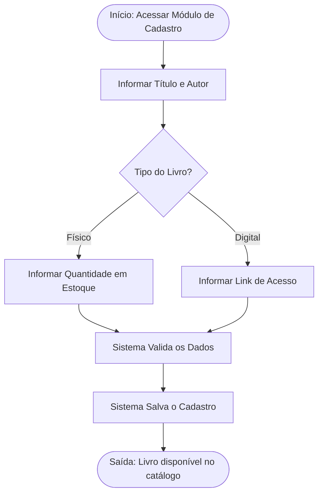
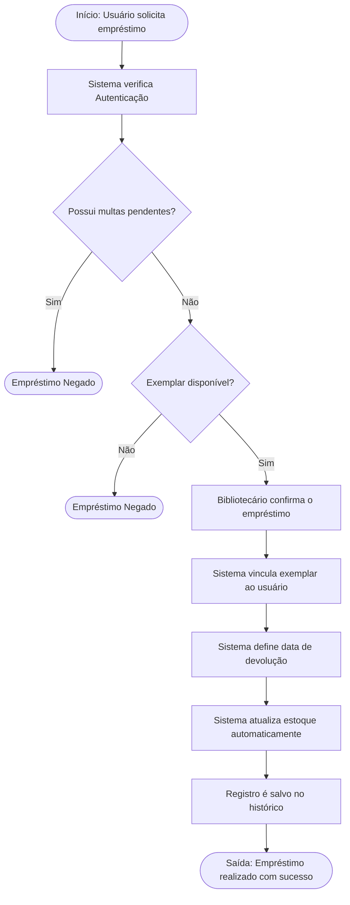
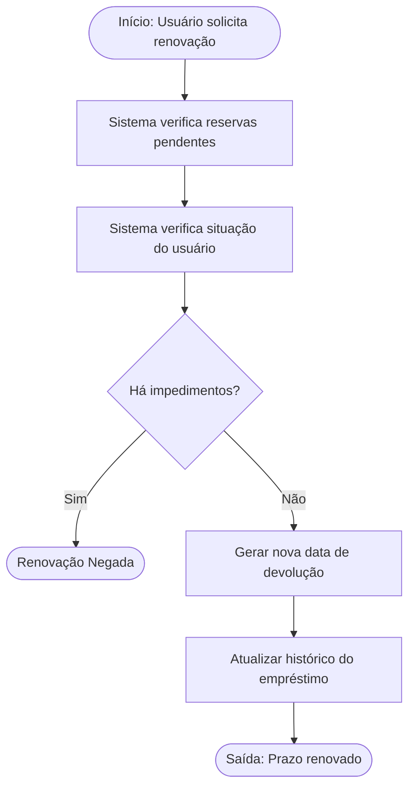
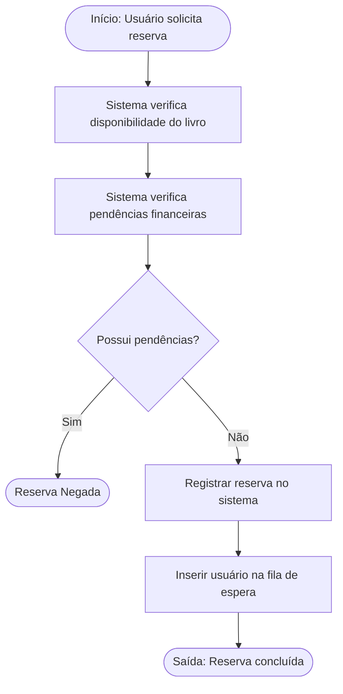
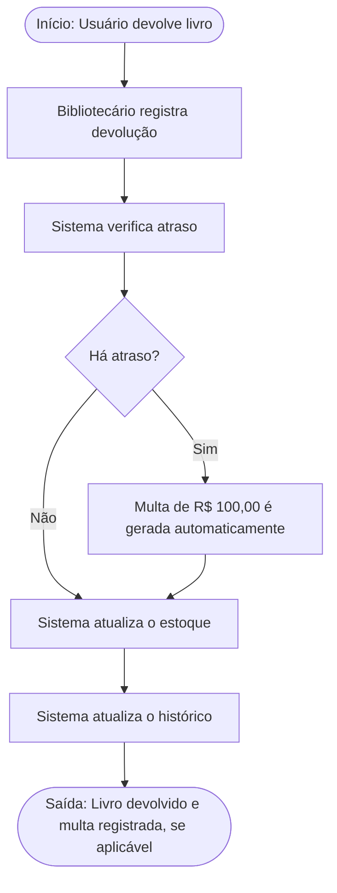
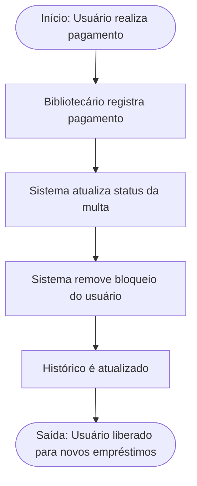
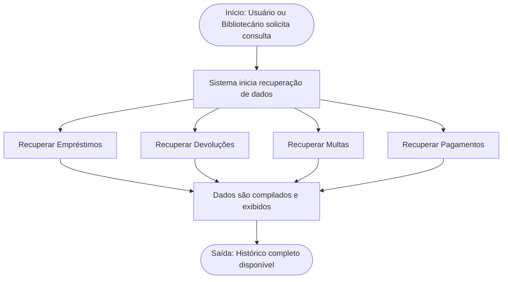
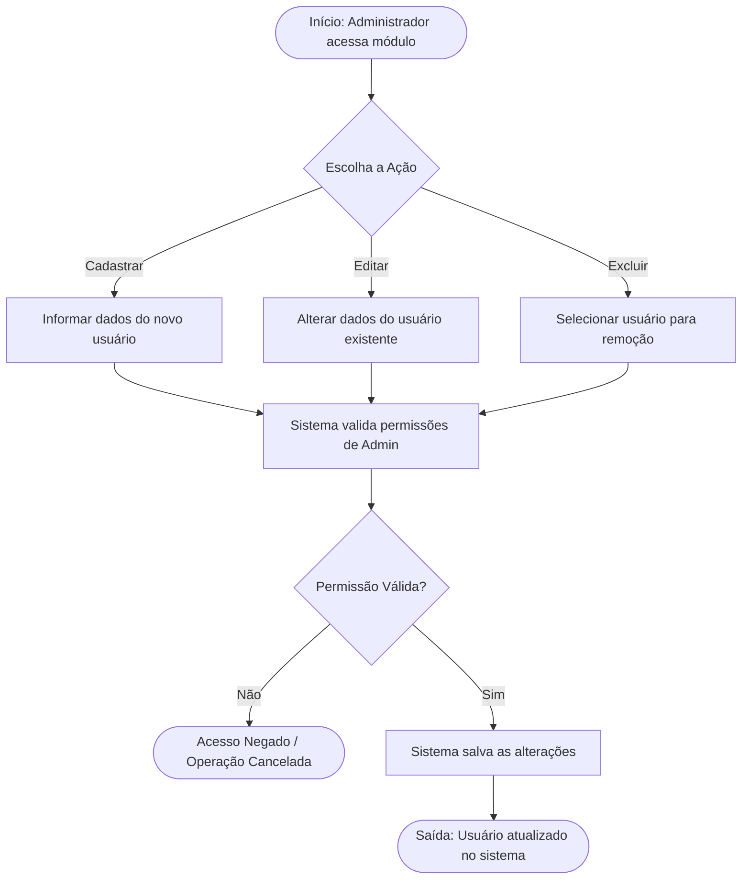
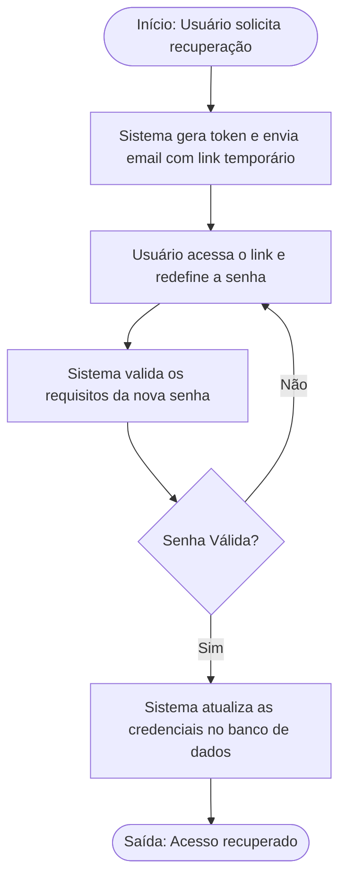
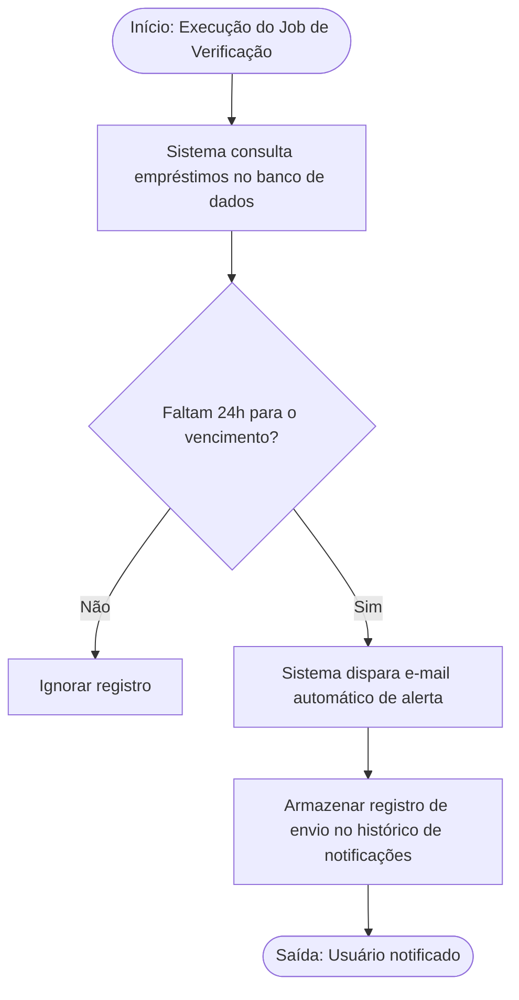

# Process Documentation

---

## Sobre

Este documento apresenta uma descriçõa detalhada dos processos existentes no sistema

---

## Visão Geral do Sistema

O sistema de biblioteca digital tem como objetivo automatizar e centralizar os processos de gestão de acervo físico e digital, empréstimos, reservas, penalidades e gerenciamento de usuários.
A solução busca eliminar problemas encontrados no modelo atual baseado em planilhas, como:

- Falta de rastreabilidade de empréstimos; 
- Erros no controle de estoque físico; 
- Dificuldade no gerenciamento de conteúdos digitais; 
- Baixa confiabilidade das informações; 
- Ausência de controle automatizado de multas e bloqueios.

---

## Objetivos do sistema

Implementar uma plataforma digital integrada para controle de acervo, empréstimos, reservas e acesso a conteúdos digitais.

### Objetivos Específicos

- Automatizar o controle de estoque físico; 
- Centralizar o gerenciamento de livros físicos e digitais; 
- Garantir rastreabilidade das operações; 
- Automatizar cálculo de multas; 
- Melhorar a experiência do usuário; 
- Garantir segurança e conformidade com a LGPD.

---

## Perfis de Usuários 

**Leitor:**

- Consultar acervo; 
- Solicitar empréstimos; 
- Renovar empréstimos; 
- Consultar histórico; 
- Acessar livros digitais. 

**Bibliotecário:**

- Gerenciar acervo; 
- Controlar estoque; 
- Aprovar empréstimos; 
- Registrar devoluções; 
- Gerenciar multas; 
- Cadastrar usuários. 

**Administrador do Sistema:**

- Administração geral; 
- Auditoria; 
- Controle de permissões; 
- Gestão de disponibilidade e segurança.

---

## Processos

### Processo de cadastro de livros

Permitir o registro de livros físicos e digitais no sistema.

**Requisitos Relacionados:**

- RF01 — Cadastro de Títulos 
-	RF03 — Catálogo Digital 

**Fluxo do Processo:**

**Regras de Negócio:**

- Todo livro deve possuir título e autor. 
- Livros digitais devem possuir link válido. 
- Estoque físico não pode ser negativo.

### Empréstimo de livro 

Registrar empréstimos de exemplares físicos.

**Requisitos Relacionados:**

- RF02 — Controle de Estoque 
- RF04 — Realização de Empréstimo 
- RF07 — Bloqueio por Inadimplência 
- RNF05 — Integridade de Dados 

**Fluxo do Processo:**

**Regras de Negócio:**

- Usuários inadimplentes não podem emprestar livros. 
- O mesmo exemplar físico não pode possuir dois empréstimos simultâneos. 
- Apenas usuários autenticados podem realizar empréstimos.

### Renovação de empréstimo

Permitir extensão do prazo de devolução.

**Requisitos Relacionados:**

-	RF05 — Renovação de Empréstimo 

**Fluxo do Processo:**

**Regras de Negócio:**

- Não é permitido renovar livros reservados. 
- Usuários bloqueados não podem renovar empréstimos.

### Reserva de livro

Permitir reserva de títulos indisponíveis.

**Requisitos Relacionados:**

-	RF04 — Empréstimos 
-	RF07 — Bloqueio por Inadimplência 

**Fluxo do Processo:**

**Regras de Negócio:**

-	Usuários inadimplentes não podem reservar livros. 
-	Reservas seguem ordem cronológica.

### Devolução de livros

Registrar devolução e calcular multas.

**Requisitos Relacionados:**

-	RF02 — Controle de Estoque 
-	RF06 — Cálculo de Multas 
-	RF08 — Consulta de Histórico 

**Fluxo do Processo:**

**Regras de Negócio:**

- Multa fixa de R$ 100,00 por atraso. 
- Estoque deve ser incrementado automaticamente.

### Pagamento da multa

Regularizar situação do usuário.

**Requisitos Relacionados:**

- RF06 — Cálculo de Multas 
- RF07 — Bloqueio por Inadimplência 

**Fluxo do Processo:**

### Consulta de Histórico

Permitir rastreabilidade de operações.

**Requisitos Relacionados:**

- RF08 — Consulta de Histórico 
- RNF06 — Auditoria 

**Fluxo do Processo:**

### Gestão de Usuários

Gerenciar leitores e funcionários.

**Requisitos Relacionados:**

- RF09 — Gestão de Usuários 
- RNF01 — Segurança 

**Fluxo do Processo:**

**Regras de Negócio:**

- Login deve ser único. 
- Senhas devem ser criptografadas.

### Recuperação de Senha

Permitir recuperação segura de acesso.

**Requisitos Relacionados:**

-	RF11 — Recuperação de Senha 
-	RNF01 — Segurança 

**Fluxo do Processo:**

### Notificações Automáticas

Avisar usuários sobre vencimentos.

**Requisitos Relacionados:**

-	RF10 — Notificações Automáticas 

**Fluxo do Processo:**

---
